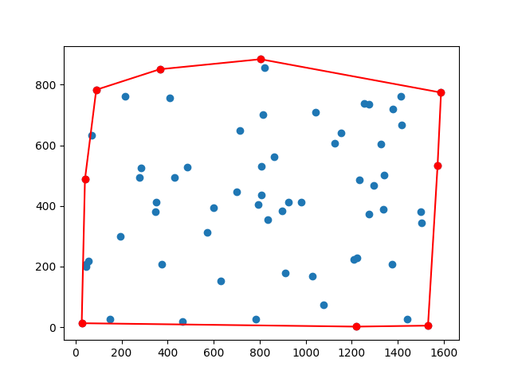
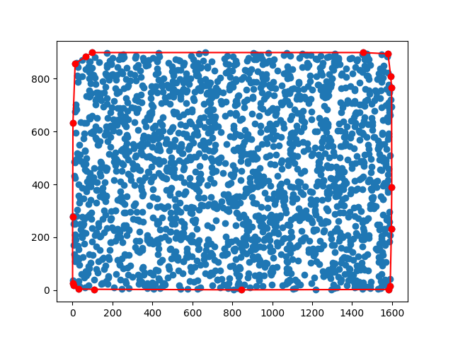

# Week5 Solve TSP

## Algorithm
### 全探索 : challenge0, challenge1
ありうるパスを全て試して最短の物を選ぶ
-> ノードが多いと、計算量が爆発する(16ぐらいで)

### Greedy : challenge2, challenge3, challenge4, challenge5, challenge6
今いるノードからもっとも近いまだ行っていないノードへ行く、という作業を繰り返す
-> 交わっているパスを直す、という2-optをすることで、より良いパスを見つけることができる

### ConvexHull Inseration : challenge2, challenge3, challenege4, challenge5
凸包を見つけて、そのあとに内側のノードを足していく．\
challenge3くらいしかない時の凸包だと

とうまく見つけられそう？な予感がするけど、\
challenge6ぐらいにもなってくると

と、内側のノードどういくかが死ぬほど大事じゃん！となる．\
(ノード数が多いとうまく行きにくいアルゴリズムそう) \
challenge6に関しては計算時間がとても長くて回しきれませんでした．．

## Result
2-opt法において、2ノードへの行き方を変えたい時、その2ノードだけをswapした場合と、その間の頂点への行き方を逆順にする場合とで、スコアが異なることに気づいたので、どちらも試しました． \
CHI法は、ノードが少ない時は有効だけど、多くなると最初の凸包を作ったあとのアルゴリズムをもっと工夫しないといけないと感じました．

* 2-opt-s : 2-opt swap 
* 2-opt-r : 2-opt reverse

|File|Exhaustive|Greedy only|Greedy+2-opt-s|Greedy+2opt-r|CHI only|CHI+2opt-s|CHI+2opt-r|
|:---|:---|:---|:---|:---|:---|:---|:---|
|input_0|**3291.62**| | | | | | |
|input_1|**3778.72**| | | | | | |
|input_2| |4709.41|4994.89|4994.89|**4494.42**|**4494.42**|**4494.42**|
|input_3| |9735.32|8605.85|8970.05|8407.29|**8293.03**|**8293.03**|
|input_4| |12110.23|11248.13|11489.79|12310.65|**11160.28**|11379.30|
|input_5| |24064.76|22187.13|**21363.60**|25081.90|22257.16|22264.10|
|input_6| |48512.32|75621.04|**42712.37**| | | |